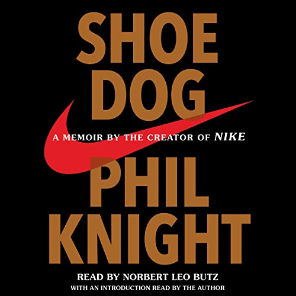

"Shoe Dog" by Phil Knight, the co-founder of Nike, takes readers on an inspiring journey through the highs and lows of entrepreneurship. From the very first page, Knight's memoir grabs your attention and immerses you in the world of a passionate individual driven by a burning desire to leave a mark on the world.

In "Shoe Dog," Knight shares his personal experiences and struggles, taking readers behind the scenes of Nike's early days. He recounts the challenges he faced, the risky decisions he made, and the relentless pursuit of his vision. One phrase that sticks with the reader throughout the book is, "The coward never started, and the weak died along the way - that leaves us." These words serve as a constant reminder of the determination and resilience required to build something meaningful.

Knight's writing is raw and honest. He doesn't shy away from highlighting the doubts and fears that plagued him along the way. Yet, despite the setbacks, he never lost sight of his ultimate goal. This authenticity brings an emotional depth to the narrative, making readers feel deeply connected to Knight's story.

What sets "Shoe Dog" apart is how Knight intertwines his personal journey with valuable insights about business, leadership, and the entrepreneurial mindset. He offers lessons learned from his many encounters, both positive and negative, and shares pearls of wisdom for anyone looking to embark on a similar path.

Beyond the business aspect, Knight's memoir is also a tale of friendship, camaraderie, and the power of teamwork. He pays tribute to the individuals who supported him throughout his challenging journey, acknowledging their contributions in making Nike the global powerhouse it is today.

"Shoe Dog" is a book that resonates with dreamers, achievers, and anyone seeking inspiration to defy the status quo. It challenges the conventional notions of success and encourages readers to listen to their inner voice, follow their passions, and embrace the uncertainty that comes with pursuing big dreams.

In conclusion, "Shoe Dog" is a captivating memoir that not only sheds light on the birth of one of the world's most iconic brands but also inspires readers to embark on their own personal quests. Phil Knight's story is a testament to the fact that success isn't merely measured by financial gains, but by the impact one leaves behind. So, if you're ready to be inspired, motivated, and moved, this book is a must-read.

